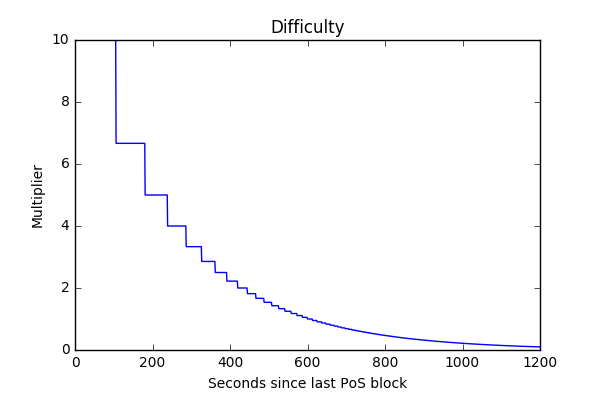
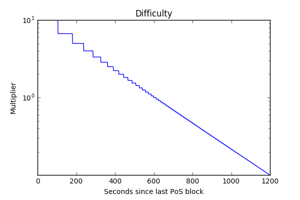

# Exponential PoS Target for Block Time Stabilization

- Status: rejected
- Type: enhancement
- Related components: `protocol`
- Start Date: 04-January-2017
- Discussion: (fill me in with link to RFC discussion - shepherd will complete this)
- Author: hrobeers

## Summary
Stabilizing the Proof-of-Stake block timing by multiplying the hash target using an exponential function of time since the last PoS block.

## Conventions
- The key words "MUST", "MUST NOT", "REQUIRED", "SHALL", "SHALL NOT", "SHOULD", "SHOULD NOT", "RECOMMENDED", "MAY", and "OPTIONAL" in this document are to be interpreted as described in [RFC 2119](http://tools.ietf.org/html/rfc2119).
- The verb "TO STAKE" or "STAKING" refers to the action of trying to create a Block using Proof-of-Stake. "STAKING" is chosen over "MINTING" to avoid confusion with "MINING".
- The verb "TO MINE" or "MINING" refers to the action of trying to create a Block using Proof-of-Work.

## Motivation
Due to the nature of Peercoin's Proof-of-Stake algorithm, large variations in time between Proof-of-Stake blocks exist.
Large holders tend to stake their coins periodically and start staking at low difficulty, producing blocks at a much higher rate than intended.
Once all the large holder's coins successfully staked, the Proof-of-Stake target is raised significantly leading to block timings much larger than intended until the target has settled again.
This behavior restults in unpredictable confirmation times and therefore compromises the reliability and usability of transactions on the peercoin blockchain.

Unlike the Proof-of-Work scheme, the Proof-of-Stake scheme is coupled to the network time.
This property allows for a much finer control over the hash target, making it harder to stake blocks with an interval smaller than the spacing target, and making it easier to stake blocks with an interval larger than the spacing target.
Such a system would naturally push the block interval closer to the target even when large stakeholders suddenly join or leave the network.

## Detailed Design
The hash target for PoS blocks is multiplied by a factor ranging between 0.1 and 10, meaning that the difficulty to stake a block one second after a previous block equals 10 times the static difficulty, while the difficulty to stake a block 20 minutes or later after a previous block equals the static difficulty divided by 10.
To make this multiplier equal to 1 with a 10 minute interval, an exponential function should be used to calculate it based on the number of seconds since the last block.

### Exponential Multiplier
Since the hash target is encoded as a 256bit integer that only supports multiplication by an integral number, a sampled version of the continuous exponential function is used.
The sampling resolution is a trade off between low difficulty steps and a reduction of the hash target range.
One could argue that it would be simpler to implement only a few difficulty steps instead of a sampled exponential function, however the bigger the step in difficulty the higher the chance two blocks are staked short after the difficulty reduction.
Therefore a resolution multiplier `res=20` is chosen to produce reasonable low difficulty steps while limiting the reduction of the hash target range to a factor 10.
The function can be implemented as a lookup table to completely avoid sensitivity to compiler floating point precision.

The resulting exponential multiplier function is defined by the function below.

```python
res = 20            # resolution multiplier
cte = ln(10)/600    # growth constant: multiply hash target by 10 every 600 seconds

f(t) = floor(res*0.1*(exp(cte * t)))/res
```

The difficulty to stake a block is inversely proportional to the hash target.
The figures below illustrates the decrease in difficulty to stake over the 20 minute interval.




Note that the difficulty is limited by the `[0.1, 10]` interval.

### Staking Future Blocks
One could argue that this multiplier incentivizes staking blocks in the future, as a future block has a much lower difficulty to stake.
Therefore, it is important that this multiplier is included in the calculation of the chain trust, so that if a node stakes a block in the future, it will be orphaned by blocks closer to the present.

Staking future blocks is nothing new, the current protocol accepts future blocks in a certain range and doesn't require blocks on the chain to have a strictly rising time.
Malicious nodes can decide to stake a wider timerange to increase their chances of finding blocks or to organize their blocks to increase their chances on a successful double spend attack.

The exponential target multiplier makes it very hard to stake a block prior or close to the previous block, effectively increasing the timerange required by an attacker for his block streak.
On the other hand, the chances of finding a block in the far future is drastically increased.
Therefore, well behaving nodes should shelve future blocks until their block time is reached, so they won't participate in staking blocks on top of a future block.
The clocks of well behaving nodes are not expected to drift more than a few seconds, meaning that an honest future block is not expected to be shelved longer than expected network relay times.

Opportunistic nodes might stake on top of both chains.
To effectively stake on top of a future block, the search interval should be extended even further in the future, meaning that the future chain will very rapidly exceed the maximum allowed clock drift, resulting in all nodes discarding it quickly.
While the honest chain will easily outperform the future chain's trust that is at best advancing at the edge of the maximum clock drift with less and lower trust blocks.

##### *Note about Proof-of-Work*
*When considering Proof-of-Work mining a miner mining a future chain takes a big risk by putting its hash power at stake on the future chain.
Reinforcing the hybrid nature of the Peercoin blockchain so it becomes feasible to require a Proof-of-Work confirmation next to Proof-of-Stake confirmations, would considerably increase transaction security.
The discussion about reinforcing the hybrid nature is outside the scope of this proposal as its benefits are independent of it.*

### Implementation
*At the time of writing (05-January-2017), this concept is being implemented parallel to this discussion, to be published and tested on peercoin's testnet soon after.*

Code changes to the current retarget algorithm can be easily avoided by not including the multiplier in the block's nBits field.
The multiplier is fully determined by the time since the last Proof-of-Stake block, therefore the multiplier should be calculated on the fly during the actions listed below:

* Block creation
* Block validation
* Block trust calculation

No changes to the block serialization are required.
However, old and new clients will often reject each other's blocks.
Therefore, a hard fork is required for this protocol change.

## Advantages

* Proof-of-Stake blocks are staked at a much more stable rate closer to the target rate.
* To produce multiple blocks in a row, an attacker needs to dominate the network for a larger timespan.
* The competitive advantage of staking a wide timerange is greatly reduced.
* The influence of network latency on block creation, provided it is an order of magnitude lower than the expected block spacing, is greatly reduced.
* Chance-to-stake pre-calculation accuracy is reduced, incentivizing more continuous staking.
* Block timestamps differ less from the actual creation time.

## Drawbacks

* If future blocks are handled incorrectly by the network, a future attack is cheap to execute.
Care should be taken to correctly shelve future blocks.

## Alternatives

* Controlling the next block's hash target using a PID controller to more dynamically adapt to changes in staking power.
However, due to the unstable block timing, the PID controller must be tuned very conservatively, therefore having a much lower effect than a time dependent multiplier.

## Unresolved questions

* Fine tune multiplication factors and decay constant.
* Current network clock drift?
* Reasonable clock drift that can be assumed between honest nodes, provided that large percentage syncs over NTP?
* Finishing the implementation
* Testing on testnet
